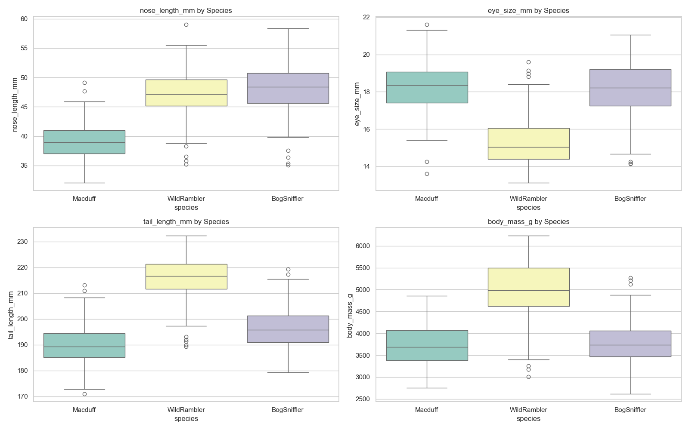
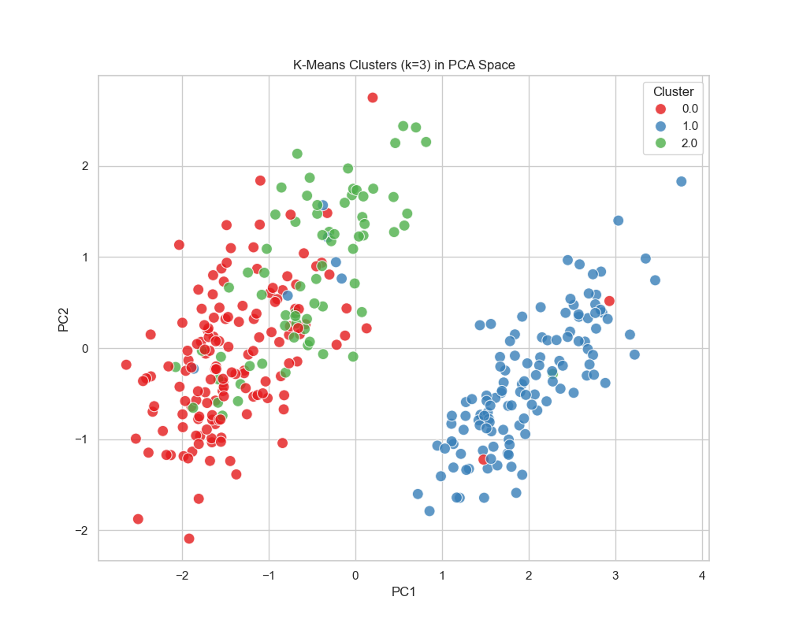
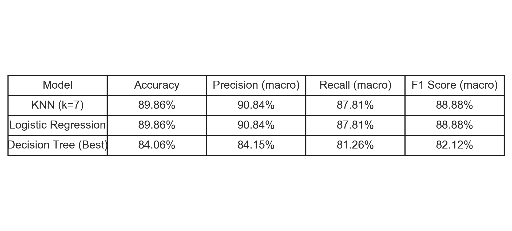
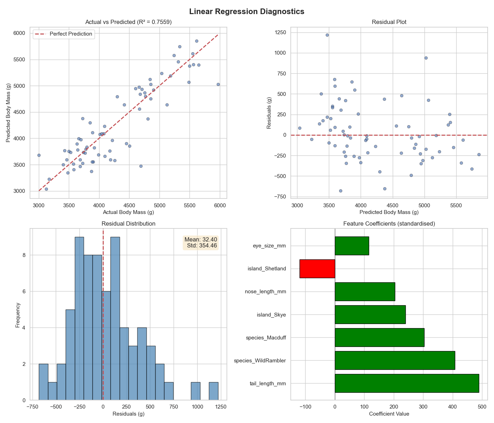
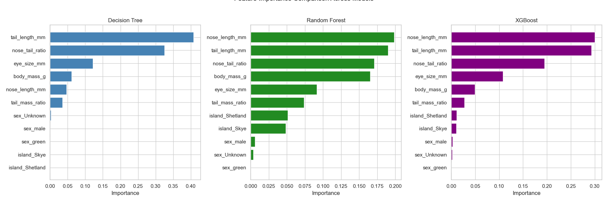

# Haggis Data Mining & Predictive Modelling

> End-to-end ML pipeline on the Scottish Haggis dataset - EDA, feature engineering, unsupervised clustering (K-Means + DBSCAN), supervised classification across 7 models, and Linear Regression with full diagnostic validation. Strict leakage prevention via sklearn Pipelines with ColumnTransformer throughout.

<p align="center">
  
  
  
  
  
</p>

---

## 📸 Visualisations

### Pairplot - Feature relationships and species separability across all numeric feature


### PCA 2D projection - K-Means cluster assignments vs ground-truth species labels


### Classification results - Accuracy, F1, Precision and Recall across all 7 models
 

### Linear Regression diagnostics - Actual vs Predicted, Residuals, Q-Q Plot, Coefficient Analysis
 

### Feature importance comparison across Decision Tree, Random Forest, and XGBoost
 

---

## 📐 Pipeline Overview

```
Stage 1 — EDA & Feature Engineering
  ├── Data loading & inspection (344 entries, 7 features + target)
  ├── Distribution analysis (histograms, boxplots, pairplot, correlation matrix)
  ├── Missing value handling (2 rows dropped, sex imputed as 'Unknown')
  ├── Outlier detection via IQR — 0 outliers confirmed
  ├── Feature engineering: nose_tail_ratio, tail_mass_ratio
  └── PCA (2D) — linear separability assessment

Stage 2 — Unsupervised Learning
  ├── Elbow method + Silhouette analysis → optimal k=3
  ├── K-Means clustering (k=3)
  └── DBSCAN clustering - arbitrary shape detection + noise identification

Stage 3 — Supervised Classification (Tree-based)
  ├── Baseline Decision Tree (unpruned)
  ├── Pre-pruning via GridSearchCV (max_depth, min_samples_split, min_samples_leaf)
  ├── Post-pruning via Cost-Complexity Pruning (CCP alpha)
  ├── Random Forest (bagging ensemble)
  └── XGBoost / Gradient Boosting (sequential boosting ensemble)

Stage 4 — Supervised Classification (Comparative)
  ├── KNN — optimal k selected via cross-validation elbow (k=7)
  ├── Logistic Regression (multinomial softmax)
  └── Cross-model comparison: accuracy, F1, precision, recall

Stage 5 — Supervised Regression
  ├── Linear Regression predicting body_mass_g
  └── Full diagnostic validation: residuals, Q-Q plot, actual vs predicted
```

---

## 🧠 Design Decisions

**Leakage prevention via sklearn Pipelines** - All preprocessing (RobustScaler, OneHotEncoder via ColumnTransformer) is encapsulated inside Pipeline objects. This ensures the scaler is fit only on training data within each cross-validation fold — a common source of data leakage when preprocessing is applied before splitting. Every model uses the same pipeline structure for fair comparison.

**RobustScaler over StandardScaler** - RobustScaler uses median and IQR rather than mean and standard deviation, making it less sensitive to any outliers that may be present. Applied consistently across distance-based algorithms (K-Means, KNN) where scale directly affects results.

**Algorithm-specific preprocessing decisions** - Scaling requirements were assessed per algorithm: K-Means and KNN are distance-based and require scaling; Decision Trees and ensemble methods are scale-invariant but benefit from encoding. This is documented explicitly in the notebook rather than applying a blanket approach.

**Engineered features validated before inclusion** - `nose_tail_ratio` and `tail_mass_ratio` were visualised by species and confirmed to have discriminative power before being added to the feature set. Both emerged as top-3 predictors across all classification models — validating the engineering decision quantitatively.

**Elbow + Silhouette dual validation for k** - Optimal k=3 was confirmed by both the Elbow method (inertia inflection) and Silhouette analysis (peak score), not selected arbitrarily. This dual validation reduces the risk of selecting a k that looks good by one measure but is statistically weak.

**DBSCAN as a validation check** - DBSCAN was applied not as the primary clustering approach but as a cross-check against K-Means. Its ability to identify noise points and clusters of arbitrary shape provides a complementary perspective on whether K-Means' spherical cluster assumption is valid for this dataset.

**Regression assumption validation** - The Linear Regression model is validated through four diagnostic plots: actual vs predicted, residual distribution, Q-Q plot for normality, and standardised coefficient analysis. Reporting only R² without checking assumptions would be insufficient.

---

## 📊 Results

### Classification

| Model | Test Accuracy | Notes |
|---|---|---|
| Baseline Decision Tree | 84.06% | Unpruned — overfits training data |
| Pre-pruned Decision Tree | ~86% | GridSearchCV tuned |
| CCP-pruned Decision Tree | ~86% | Cost-complexity pruning |
| **Random Forest** | **89.86%** | Bagging ensemble — best interpretability/accuracy balance |
| **XGBoost (Gradient Boosting)** | **89.86%** | Sequential boosting — matches RF |
| **KNN (k=7)** | **89.86%** | Optimal k via cross-validation elbow |
| **Logistic Regression** | **89.86%** | Multinomial softmax — most interpretable |

> Four models tie at 89.86% — the ceiling for this dataset given its natural class overlap. The choice between them depends on interpretability vs. computational cost requirements.

### Feature Importance (cross-model consensus)

| Rank | Feature | Source |
|---|---|---|
| 1 | `tail_length_mm` | Top predictor across all models — root split in Decision Tree |
| 2 | `nose_tail_ratio` | Engineered feature — top-3 across all models |
| 3 | `tail_mass_ratio` | Engineered feature — consistent top-3 across all models |

> Both engineered features outperform raw measurements in predictive importance - validating the feature engineering decisions quantitatively.

### Regression

| Metric | Training Set | Test Set |
|---|---|---|
| R² | ~0.80 | **0.756** |
| Mean Absolute Error | 287.9g | 269.6 |
| Root Mean Absolute Error | 359.8g | 353.4 |

> R²=0.756 means the model explains 75.6% of variance in haggis body mass from morphological features alone. Residual diagnostics confirm assumptions hold: residuals are approximately normally distributed with no significant heteroscedasticity.

---

## 📋 Dataset

| Property | Value |
|---|---|
| Source | Scottish Haggis Dataset 2025 (`scottish_haggis_2025.csv`) |
| Entries | 344 (342 after cleaning) |
| Features | `nose_length_mm`, `eye_size_mm`, `tail_length_mm`, `body_mass_g`, `island`, `sex` |
| Engineered features | `nose_tail_ratio`, `tail_mass_ratio` |
| Target (classification) | `species` — BogSniffler (44%), Macduff (36%), WildRambler (20%) |
| Target (regression) | `body_mass_g` |
| Missing values | 2 rows dropped (complete morphological missingness), sex imputed as 'Unknown' |
| Outliers | 0 detected via IQR method |

---

## 🚀 Getting Started

### Prerequisites
- Python 3.8+
- Jupyter Notebook or VS Code with Jupyter extension

### Install dependencies

```bash
git clone https://github.com/AhmedIkram05/haggis-predictive-modeling.git
cd haggis-predictive-modeling
pip install pandas numpy matplotlib seaborn scikit-learn xgboost jinja2
```

### Run

Open `Ahmed_Ikram_2571642_Final_Project.ipynb` in Jupyter or VS Code and run all cells. The notebook is structured sequentially across 5 stages - each stage builds on the cleaned and engineered data from the previous one.

---

## 📦 Tech Stack

| Concern | Tools |
|---|---|
| Data manipulation | Pandas, NumPy |
| Visualisation | Matplotlib, Seaborn |
| Preprocessing | Scikit-learn (RobustScaler, ColumnTransformer, OneHotEncoder) |
| Clustering | Scikit-learn (KMeans, DBSCAN) |
| Classification | Scikit-learn (DecisionTree, RandomForest, GradientBoosting, KNN, LogisticRegression) |
| Boosting | XGBoost (via sklearn GradientBoostingClassifier) |
| Dimensionality reduction | Scikit-learn PCA |
| Regression | Scikit-learn LinearRegression |

---

## 📁 Related Project From Me

- [CineMatch Recommendation System](https://github.com/AhmedIkram05/movie-recommendation-system) - hybrid ML recommendation engine benchmarked across three strategies
- [ATM Log Aggregation & Diagnostics Platform](https://github.com/AhmedIkram05/laad) - production data engineering with RAG diagnostic assistant
- [W3C Web Logs ETL Pipeline](https://github.com/AhmedIkram05/W3C-ETL-Pipeline) - parallel Airflow ETL with Power BI analytics
